# Himax-AIoT-WiFi-G1 Platform EVB USER GUIDE

Himax-AIoT-WiFi-G1 platforms EVB includes Himax WE-I Plus MCU, image sensor and rich peripheral supports. The details are given in the following paragraph.


## Table of contents

- [Himax-AIoT-WiFi-G1 Platform EVB](#himax-aiot-nb-g3-platform-evb)
- [System Prerequisites](#system-prerequisites)
  - [Hardware Environment Setup](#system-requirement)
  - [Software Tools](#system-requirement)
- [Code building](#code-building)
- [Deploy image to Himax-AIoT-WiFi-G1 Platform EVB](#deploy-image-to-himax-aiot-wifi-g1-platform-evb)
  - [Startup Flowchart](#startup-flowchart)
  - [Power ON EVB](#power-on-evb)
  - [Flash Image via OTA tool](#flash-image-via-ota-tool)
  - [Boot from i2c](#boot-from-i2c)
  - [Check UART Message Output](#check-uart-message-output)
- [Retrieve detection result on Himax-AioT-WiFi-G1](#retrieve-detection-result-on-himax-aiot-wifi-g1)
  - [PC tool](#pc-tool)
  - [Wifi](#wifi)


## Himax-AIoT-WiFi-G1 Platform EVB


  1.	Himax WE-I Plus chip
  3.	HM0360 AoS<sup>TM</sup> VGA camera
  4.    Microphones (L/R) at back side
  5.	3-Axis Accelerometer
  6.	3-Axis Gyroscope
  7.	3-Axis Magnetometer
  8.	Reset Button
  9.	GREEN LED x2 and RED LEDx1 and BLUE LEDx1
  10.	Micro-USB cable (I2C/SPI/Flash Download)

  <a href="docs/HX6539-A_HWUG(WiFi-ESP12F)_preliminary.pdf" target="_blank">Hardware user guide PDF</a>

<br>

## System Prerequisites
  - Operating system
    - Ubuntu 20.04 LTS   
    <br>

  - Development toolkit
    - GNU Development Toolkit

      See [ARC GNU Tool Chain](https://github.com/foss-for-synopsys-dwc-arc-processors/toolchain) section for more detail, current released GNU version is [GNU Toolchain for ARC Processors, 2021.03](https://github.com/foss-for-synopsys-dwc-arc-processors/toolchain/releases/tag/arc-2021.03-release). After download and extract toolkit to local space, please remember to add it to environment PATH. For example:

      ```
      export PATH=[location of your ARC_GNU_ROOT]/bin:$PATH
      ```
  <br>
  
  - Hardware Environment Setup
    - Prepare a micro-USB cable to connect to EVB with PC(used as Power/UART)

  <br>

  - Software Tools
    - OTA tool (Windows application, image flash)
    - HMX-AIOT-FT4222H_GUI (Windows application, I2C/CLK/SPI)
      ```
      Tools can be found in Himax-AIoT-WiFi-G1-SDK/tools/
      ```
    - UART Terminal Application such as [TeraTerm](https://ttssh2.osdn.jp/index.html.en).

<br>

## Code building

Default building toolchain setting in makefile is Metaware Development toolkit(***mw***), please change it to ***gnu*** in `Makefile`(Himax-AIoT-WiFi-G1-SDK/makefile).

```
ARC_TOOLCHAIN ?= gnu
```

Before building, you need to change permission in `Himax-AIoT-WiFi-G1-SDK\tools\image_gen_cstm\output` directory.
```
chmod 777 *
```
Build code & generate image. The output images will be named `output.img` and saved under `Himax-AIoT-WiFi-G1-SDK\tools\image_gen_cstm\output`.
```
make clean && make && make flash 
```
<br>

## Deploy image to Himax-AIoT-WiFi-G1 Platform EVB
Use the following procedure to startup the Himax-AIoT-WiFi-G1 platform EVB.
<br>

### ***Startup Flowchart***

  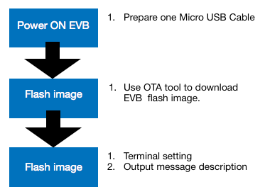

### ***Power ON EVB***
 - Power supply by usb or battery(AAA*4)


### ***Flash Image via OTA tool***
> All following steps are done in Windows.
  
  - ***Step 1:*** Follow image below to switch pins on ***Himax-AIoT-WiFi-G1 Platform EVB***.
  
    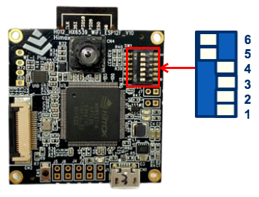 

  - ***Step 2:*** Connect with PC USB to power on ***Himax-AIoT-WiFi-G1 Platform EVB***.

  - ***Step 3:*** Check if you can see [UART Message Output](#check-uart-message-output).
    If no, refer to [Boot from i2c](#check-uart-message-output) to flash image.     

  - ***Step 4:*** Use `/tools/OTA_Tools/ota.exe` to download EVB image.
    - ***Step 4.1:***
    Open OTA.exe<br>
    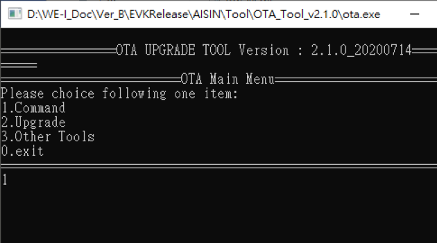
   
    
    - ***Step 4.2:***
      Select `1.Command->1.Intoupg`<br>
      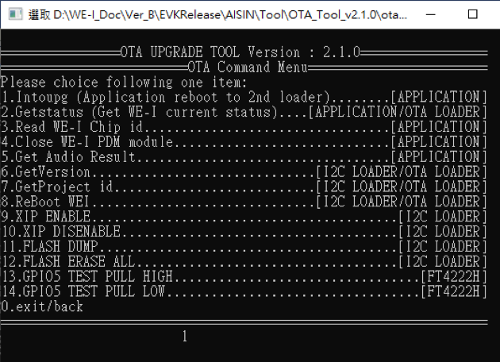
    
        If sucessful, the highlight message <span style="color:red">"Please use OTA UPGRADE TOOL Version : x.x.x"</span> will be shown in `TeraTerm`. Now the device is ready for OTA flash programming.
        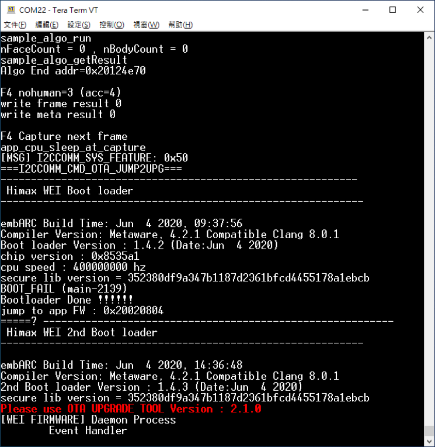

    - ***Step 4.3:*** 
        Switch back to OTA tool and select `2.Upgrade->1.FORCE UPGRADE` to start upgrade image.

        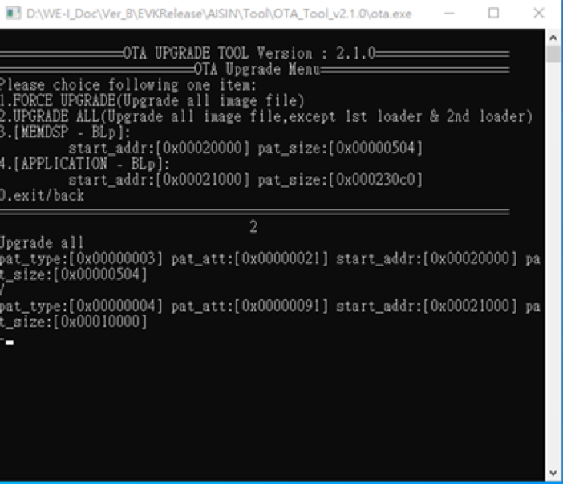

    - ***Step 4.4:*** Wait for a while, the device will reboot when flash process complete.
 
### ***Boot from i2c***
> If OTA process isn't accessible, boot from i2c to reload 2nd bootloader to fix problem.

- ***Step 1:*** Connect with PC USB to power on ***Himax-AIoT-WiFi-G1 Platform EVB***. 
- ***Step 2:*** Turn pin #1 switch on & press `Reset button` to reset.  

    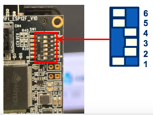

- ***Step 3:*** Excute OTA.exe on `/tools/OTA_Tools/` and select <br><span style="color:red">3.Other Tools->1.Boot from I2C</span>.

- ***Step 4:*** Enter the input files path manually:<br>`BootUpFromI2C\HX6537-A09TDIG-1111V_QFN72_Debug\sign_formal_PA8530_EM9D_2nd_Bootloader.bin`.<br> 

    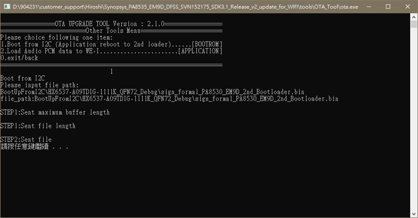

    The board will reboot & enter 2nd boot loader, you will see the message <span style="color:red">"Please use OTA UPGRADE TOOL Version : x.x.x"</span> that is the same as normal OTA process. Now, just follow normal [Flash Image via OTA tool](#flash-image-via-ota-tool) section to complete process.

    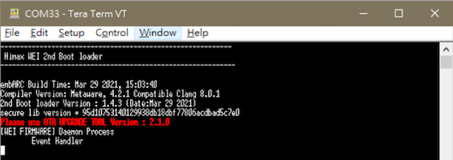

### ***Check UART Message Output***
  - Serial Terminal Emulation Application Setting

    |   |  |
    | :------------ |:---------------:|
    | Baud Rate  | 115200 bps |
    | Data | 8 bit |
    | Parity  | none  |
    | Stop  | 1 bit  |
    | Flow control | none |

  The system will output the following message to the UART console. Please setup UART terminal tool setting as (115200/8/N/1).

  - Display Log Message
  In the example, we use TeraTerm to see the output message.

    - TeraTerm New Connection

        

    - TeraTerm Select COM Port

        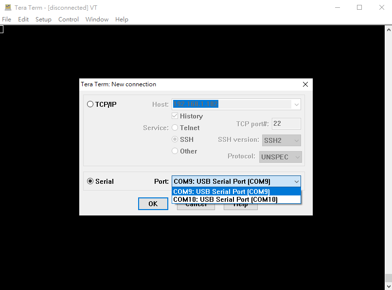

## Retrieve detection result on Himax-AioT-WiFi-G1
### ***PC Tool***
1. Excute GUI tool HMX_FT4222H_GUI.exe under \tools\HMX_FT4222H_GUI\GUI_binary\.
2. Select 'SPI slave' tab.
3. In Receive Image/Data field, select 'ALGO' then click the 'Receive' button.
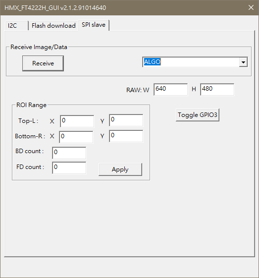
4. The GUI PC_Tool will pop a new window 'Simple_FRAMES' to display the captured image and the person detection result.
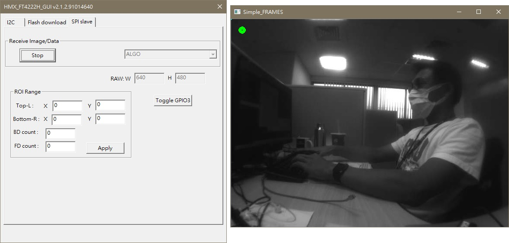
5. In the 'Simple_FRAMES' window, the left-top indicator disply whether human is presence or not.
    
    Green (human detect); Red (no human detect).
    
    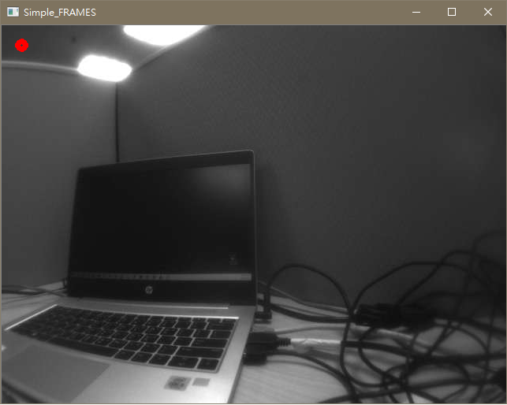

### ***WiFi***

1. Setup the TCP Server Example on PC.
  - ***1.1.*** Connect your Win10 PC to WiFi AP.
  - ***1.2.*** Use ipconfig to get the IP Address of your PC.
  
    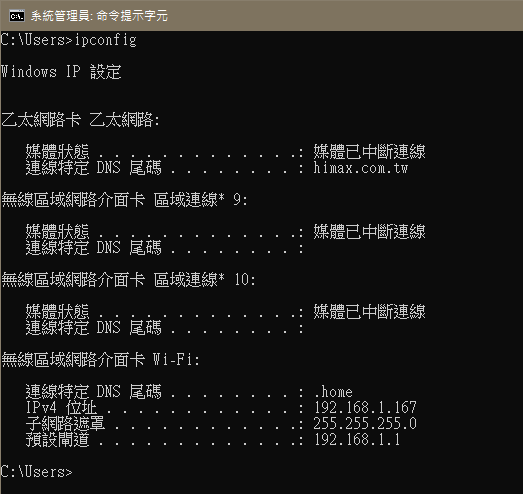
  
  - ***1.3.*** Execute ***tcp_server_example.py*** on ***tools/tcp_server_example/***
    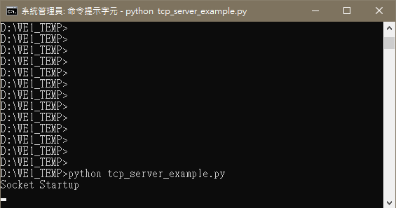
  - ***1.4.*** The tcp_server_example is ready to receive data.

2. Setup Himax-AIoT-WiFi-G1.
  - ***2.1.*** Download the SDK.
  - ***2.2.*** According to your WiFi environment to config the settings in to app/scenario_app/aiot_example/app_main.c:
      > #define SSID "your_wifi_ssid" //your wifi ssid <br>
      > #define PASSWD "your_wifi_password" //you wifi password
  - ***2.3.*** Set the SERVER_IP to the IP got from ***Step 1.2***
      > #define SERVER_IP "192.168.1.100" //your tcp server ip
  - ***2.4.*** Build the image and upgrade to Himax-AIoT-WF-G1([Flash Image via OTA tool](#flash-image-via-ota-tool)).
  - ***2.5.*** After Himax-AIoT-WF-G1 boot up, it should connect to the TCP Server(PC).

3. Himax-AIoT-WF-G1 continues to sending JPGs and human-detection result to the TCP Server(PC).
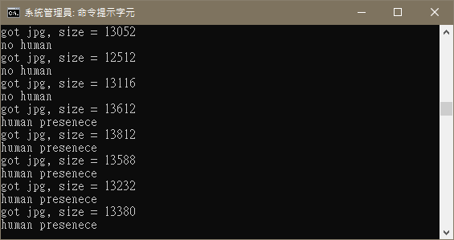


## TensorFlow Lite for Microcontroller Example 

### TFLM Model Path
  - Put your training model in Himax-AIoT-WiFi-G1\library\cv\tflitemicro_25\examples\person_detection_experimental\

